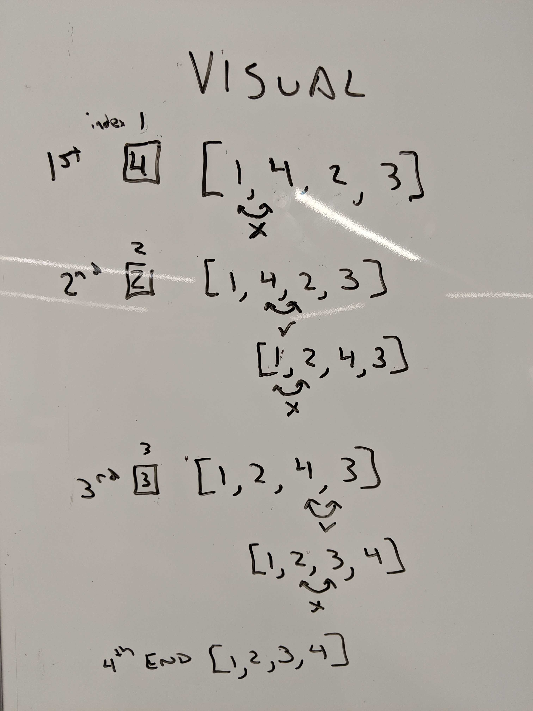

# Lecture Notes: Insertion Sort

Insertion sort is a simple sorting algorithm that builds the final sorted array (or list) one item at a time. It is much less efficient on large lists than more advanced algorithms such as quicksort, heapsort, or merge sort. (Wikipedia: 2019)
 
Insertion sort can be done in place, which requires constant space.  But is a O(n^2) time complexity algorithm.

# Learning Objectives
- You will learn about insertion sort
    - Dealing with insertions and shifting elements.
    - Understanding the complexity of Insertion Sort

# Lecture Flow
Insertion sort is a simple inplace sorting algorithm
   - Uses 2 loops
       - 1st for traversing front to back
       - 2nd from traversing from the element to the beginning for insertion.
Complexity
    - Has a space complexity of O(1).
        - Can be done in place
    - Has a time complexity of O(n^2).
        - This is the worst case time complexity.(if the array is in reverse sorted order)

# Diagram



# Algorithm
- Iterate over the entire array
- At each value
    - compare that value to every value in front of it
    - Insert it where in belongs eg. Value in front is lower and value behind is greater
- Move onto the next value.
# Pseudocode
```
  InsertionSort(int[] arr)
  
    FOR i = 1 to arr.length
    
      int j <-- i - 1
      int temp <-- arr[i]
      
      WHILE j >= 0 AND temp < arr[j]
        arr[j + 1] <-- arr[j]
        j <-- j - 1
        
      arr[j + 1] <-- temp
```

# Readings and References
## Watch
[Insertion Sort](https://www.youtube.com/watch?v=OGzPmgsI-pQ)
## Read
[Wikipedia](https://en.wikipedia.org/wiki/Insertion_sort)\
[Geeks for Geeks](https://www.geeksforgeeks.org/insertion-sort/)
## Bookmark
[Sorting Algorithms](https://en.wikipedia.org/wiki/Sorting_algorithm)
