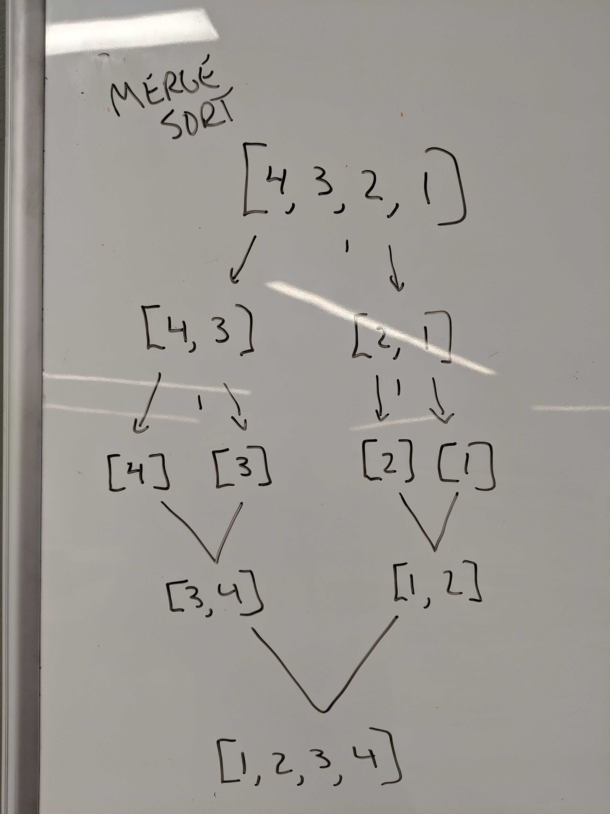

# Lecture Notes: Merge Sort

Merge sort (also commonly spelled mergesort) is an efficient, general-purpose, comparison-based sorting algorithm. Most implementations produce a stable sort, which means that the order of equal elements is the same in the input and output. Merge sort is a divide and conquer algorithm that was invented by John von Neumann in 1945. (Wikipedia 2019) 

Merge sort requires O(n) space, can be done in O(1).  But is a O(n log n) time complexity algorithm.

# Learning Objectives
- You will learn about merge sort
    - Dealing with recursion
    - Keeping track of indices
    - Understanding the complexity of Merge sort

# Lecture Flow
Merge sort is a very time efficient sorting Algorithm
   - In this demonstration we use recursion.
   - Call mergeSort on the 2 smaller Arrays
   - Merge the halves together putting the smaller number at the 2 halves on first until they are all empty.

Complexity
   - Has a space complexity of O(n).
   - Has a time complexity of O(n log n).

# Diagram



# Algorithm
- Halve the array and recursively call mergeSort on each half.
- When down to the end, (array.length <= 1) merge the arrays.
    - Push the lowest element from each array onto the bigger array until each are empty.
    - This will repeat until we get to the main function call.
- Return a sorted array.

# Pseudocode
```
ALGORITHM Mergesort(arr)
    DECLARE n <-- arr.length
           
    if arr.length > 1
      DECLARE mid <-- n/2
      DECLARE b <-- arr[0...mid]
      DECLARE c <-- arr[mid...n]
      // break down the left side
      Mergesort(b)
      // break down the right side
      Mergesort(c)
      // merge the left and the right side together
      Merge(b, c, arr)

ALGORITHM Merge(b, c, a)
    DECLARE i <-- 0
    DECLARE j <-- 0
    DECLARE k <-- 0

    while i < b && j < c
        if b[i] <= c[j]
            a[k] <-- b[i]
            i <-- i + 1
        else
            a[k] = c[j]
            j <-- j + 1
            
        k <-- k + 1

    if i = b.length
       add remaining items in array c to array a
    else
       add remaining items in array b to array a
       
    return a
```

# Readings and References
## Watch
[Merge Sort](https://www.youtube.com/watch?v=KF2j-9iSf4Q)
## Read
[Wikipedia](https://en.wikipedia.org/wiki/Merge_sort)\
[Geeks for Geeks](https://www.geeksforgeeks.org/merge-sort/)
## Bookmark
[Sorting Algorithms](https://en.wikipedia.org/wiki/Sorting_algorithm)
