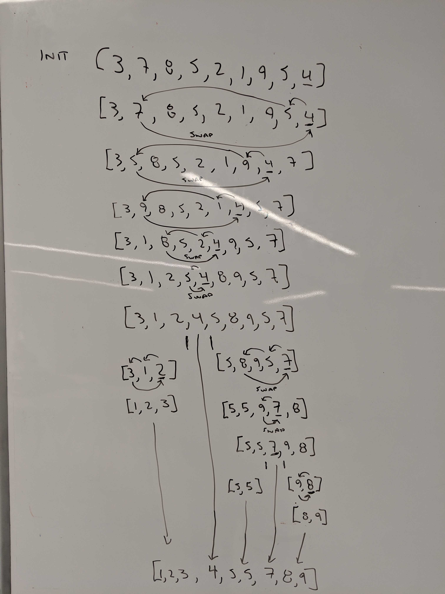

# Lecture Notes: Quick Sort
Quicksort (sometimes called partition-exchange sort) is an efficient sorting algorithm, serving as a systematic method for placing the elements of a random access file or an array in order.(Wikipedia 2019)

Quick sort requires O(log n) space. Is also O(n log n) time complexity algorithm.

# Learning Objectives
- You will learn about merge sort
    - Dealing with recursion
    - Keeping track of indices
    - Understanding the complexity of Quick sort

# Lecture Flow
Quick sort is a very time efficient sorting Algorithm for time and space.
   - In this demonstration we use recursion.
       - Call quickSort on the 2 divided parts of the array.
       - Sort the halves.
       - Swap values.
       
Complexity
  - Has a space complexity of O(log n). (worst is 0(n))
  - Has a time complexity of O(n log n).(worst is O(n^2))

# Diagram



# Algorithm
- Get a pivot point.
- Partitioning: reorder the array so that all elements with values less than the pivot come before the pivot, while all elements with values greater than the pivot come after it (equal values can go either way). After this partitioning, the pivot is in its final position. This is called the partition operation.
- Recursively apply the above steps to the sub-array of elements with smaller values and separately to the sub-array of elements with greater values.
- Return a sorted array.

# Pseudocode
```
ALGORITHM QuickSort(arr, left, right)
    if left < right
        // Partition the array by setting the position of the pivot value 
        DEFINE position <-- Partition(arr, left, right)
        // Sort the left
        QuickSort(arr, left, position - 1)
        // Sort the right
        QuickSort(arr, position + 1, right)

ALGORITHM Partition(arr, left, right)
    // set a pivot value as a point of reference
    DEFINE pivot <-- arr[right]
    // create a variable to track the largest index of numbers lower than the defined pivot
    DEFINE low <-- left - 1
    for i <- left to right do
        if arr[i] <= pivot
            low++
            Swap(arr, i, low)

     // place the value of the pivot location in the middle.
     // all numbers smaller than the pivot are on the left, larger on the right. 
     Swap(arr, right, low + 1)
    // return the pivot index point
     return low + 1

ALGORITHM Swap(arr, i, low)
    DEFINE temp;
    temp <-- arr[i]
    arr[i] <-- arr[low]
    arr[low] <-- temp
```

# Readings and References
## Watch
[Quick Sort](https://www.youtube.com/watch?v=SLauY6PpjW4)
## Read
[Wikipedia](https://en.wikipedia.org/wiki/Quicksort)\
[Geeks for Geeks](https://www.geeksforgeeks.org/quick-sort/)
## Bookmark
[Sorting Algorithms](https://en.wikipedia.org/wiki/Sorting_algorithm)
